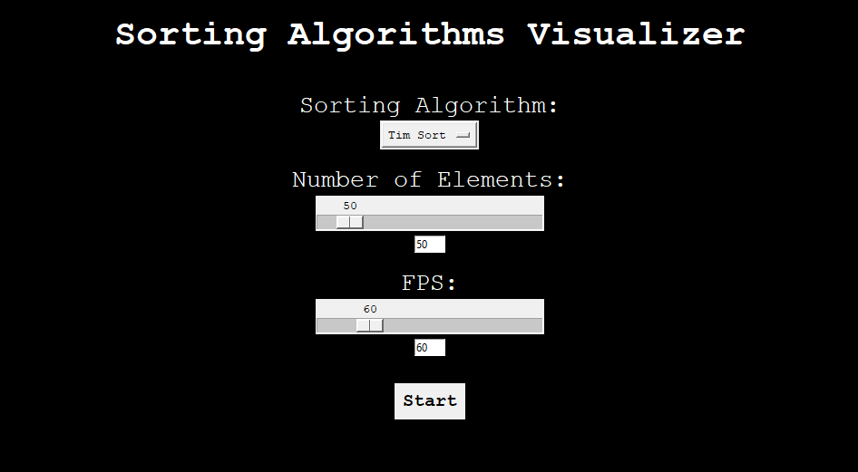

# Sorting Algorithm Visualizer

An interactive Python application built with Tkinter to visualize and compare various sorting algorithms.



## Features

- **Wide Range of Algorithms**: Visualize 18 sorting algorithms, including Tim Sort, Merge Sort, Heap Sort, Quick Sort, Radix Sort, and more.
- **Interactive Controls**: Adjust speed, pause/resume, restart, or generate new arrays during visualization.
- **User-Friendly Interface**: Simple and intuitive Tkinter-based GUI suitable for educational purposes.

## Supported Algorithms

- Tim Sort
- Merge Sort
- Heap Sort
- Quick Sort
- Radix Sort
- Shell Sort
- Comb Sort
- Cocktail Shaker Sort
- Odd Even Sort
- Insertion Sort
- Gnome Sort
- Selection Sort
- Exchange Sort
- Cycle Sort
- Pancake Sort
- Stooge Sort
- Bozo Sort
- Bogo Sort

## Controls

| **Control Key** | **Action**                        |
| --------------- | --------------------------------- |
| `+`             | Increase speed                    |
| `-`             | Decrease speed                    |
| `Space`         | Pause/Resume                      |
| `r`             | Restart current array             |
| `n`             | Generate new array                |
| `Escape`        | Exit visualization / Back to menu |

## Installation

### Prerequisites

Python 3.7 or higher

### Steps

1. Clone this repository:

   ```bash
   git clone https://github.com/TerenceCLZhang/Sorting-Algorithms-Visualizer.git
   ```

2. Navigate to the project directory:

   ```bash
   cd Sorting-Algorithms-Visualizer
   ```

3. Run the application:
   ```bash
   python main.py
   ```
